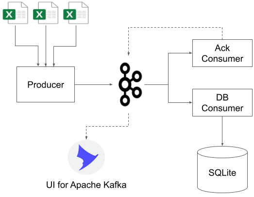
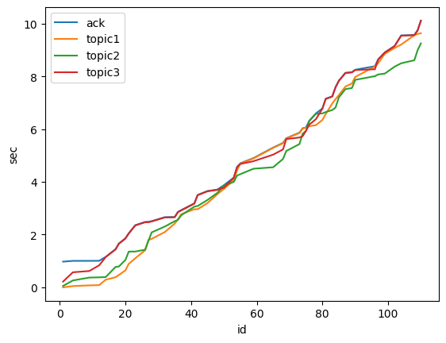
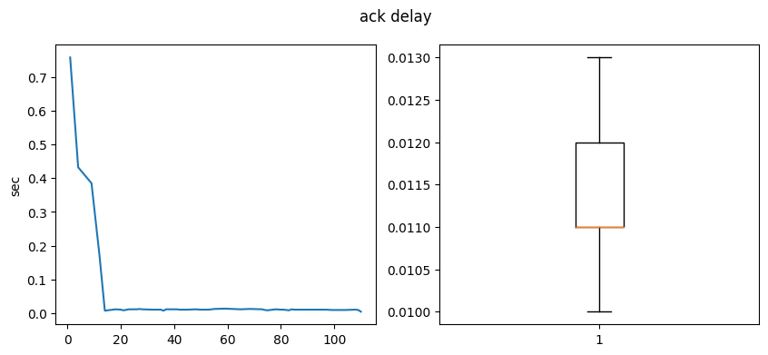

# Genetika+ simulator

This project simulates a data pipeline that interacts with Kafka to collect events into a database.

## Run

To run the simulation, launch Docker Compose cluster in the project root

```bash
$ docker compose up
```

The simulation will set up a Kafka server, a single producer and several consumers, and perform data streaming and acquisition.
The simulation results can be monitored through [UI for Apache Kafka](https://github.com/provectus/kafka-ui), and the database can be inspected.

To access the UI, go to http://localhost:8080.

## Architecture



The producer and consumers are implemented as Confluent Kafka Python clients. The data flow is following:

1. Producer reads rows from `data/sim_fileN.xlsx` and concurrently sends them to respective topics through Confluent Producer asynchronous API. Topics *topic1*, *topic2* and *topic3* are present.
1. Database consumer is subscribed to all three topics and reads messages in a single thread. Having read a message, the consumer maps its fields to the corresponding relation through SQLAlchemy ORM. Then, using the database engine, it writes single rows.
1. Ack consumer is also subscribed to the three topics and reads messages in a single thread. It maintains a persistent cache to register occurrences of the same event id in the three topics. Once an event id is delivered to all three topics, the Ack consumer produces (doh!) an ack event to the *ack* topic.
1. UI for Apache Kafka can 

## Analysis

Below are time series measured from event creation timestamps:



Each data point represents a specific event id created in the corresponding topic with its time of creation relative to the first created event.

It can be seen that the *ack* events go always after the latest occurrence of this event in *topicN* topic but not with a long delay. These delays are almost constant with the median value of 11.5 ms (see graph below).



## Testing

To run (a little) unit tests and generate a coverage report, first you need to install the simulator package locally in your virtual environment. That's as simple as

```bash
$ pip install ".[test]"
```

Then run

```bash
$ pytest --cov=simulator test/unit
```

To perform end-to-end integration test, run

```bash
$ ./test/integration/test_db_delivery.sh
```

Testing Kafka topic states is out of the scope of this project but can be easily inspected using UI at http://localhost:8080 while the cluster is up.

## Consideration

* Producer simulates data source concurrency through multithreading, which is a good mechanism even in the presence of GIL.
* Data models are described with SQLAlchemy declarative ORMs, but [pydantic](https://github.com/tiangolo/pydantic-sqlalchemy) or [marshmallow](https://github.com/marshmallow-code/marshmallow-sqlalchemy) can be used to more precisely validate data integrity.
* SQLite database is chosen for the sake of simplicity but can be easily substituted with PostreSQL thanks to the SQLAlchemy engine. The database is stored on disk, expect SQL Integrity errors on the second run of the simulator (try to revert the DB to the initial empty state).
* Acknowledger (ack consumer) uses persistent storage in the form of Python shelve for its cache. This is an important precautionary measure to address unexpected service shutdown and loss of partially collected events. Redis can be used in place of the shelve.
* Kafka service takes some time to set up after starting Compose cluster, therefore all dependent services were manually tweaked to sleep for some time after start. If some services display unexpected behavior (e.g. DB consumer receives messages only from a single topic), try increasing sleep time in `docker-compmose.yaml`
* For Kafka monitoring [kafka-exporter](https://github.com/danielqsj/kafka_exporter) can be used with the Prometheus & Graphana stack. It's very handy information for a larger scale Kafka cluster, however impractical for analyzing individual message metrics on the scale of this simulator.